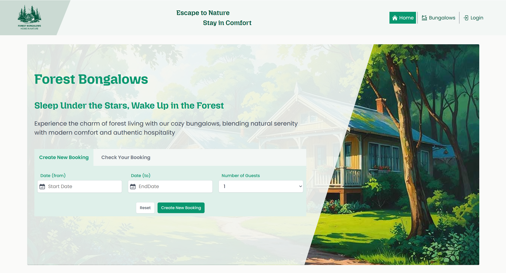
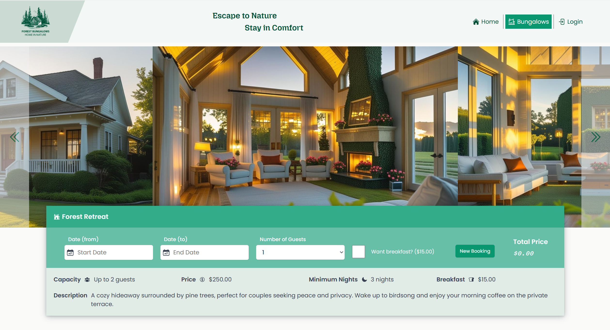
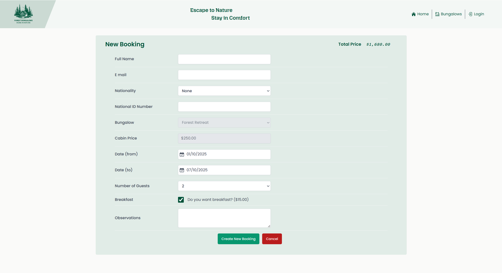
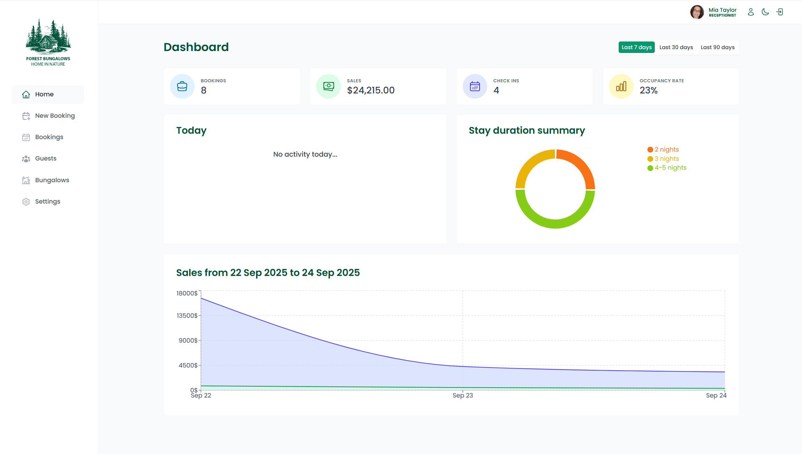
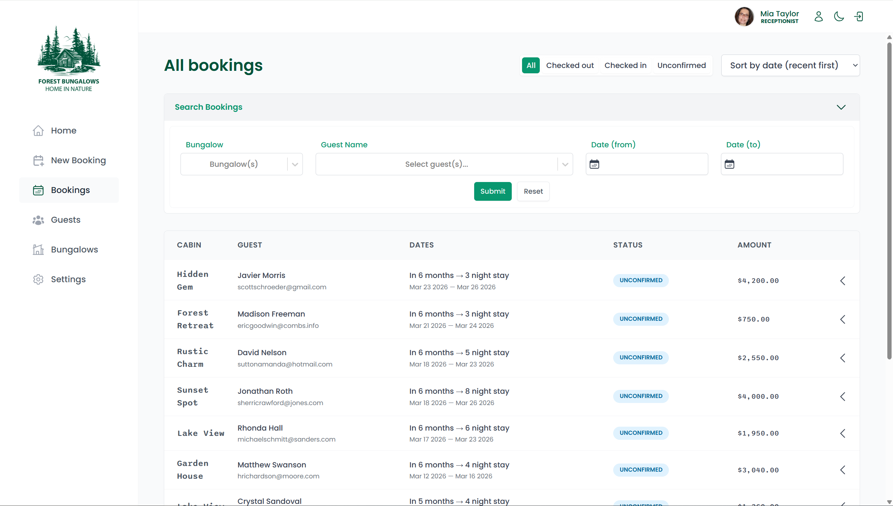
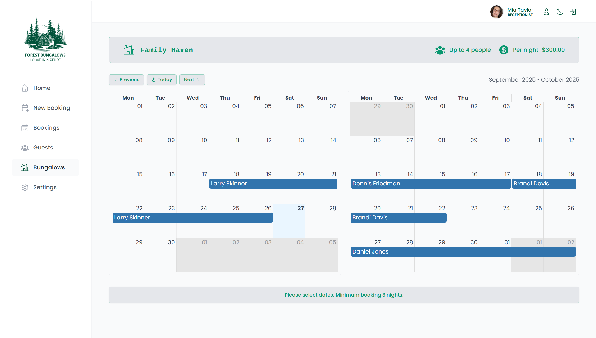

# 🌲 Forest Bungalow Booking — Frontend

[](https://react.dev/)
[](https://vitejs.dev/)
[](./LICENSE)

A modern **React + Vite** single-page application (SPA) for managing bungalow/hotel bookings.  
Includes both the **public website** for guests and the **admin dashboard** for managers and staff.

---

## 🚀 Features

### 🌍 Public Website

- Browse available bungalows
- View details and images
- Create bookings with date/guest selection
- Confirmation screen

### 🔑 Admin Dashboard

- Role-based access: `receptionist`, `manager`, `admin`, `superAdmin`
- Booking management: list, filter, update, checkout
- Calendar view of reservations (React Big Calendar)
- Cabin and guest CRUD
- Settings for nightly prices, breakfast, min/max nights

### 🎨 UI/UX

- Responsive design with **styled-components**
- Mobile-first with safe-area support
- Custom hooks for media queries, outside click, iOS tap fixes
- Toast notifications with **react-hot-toast**

---

## 🖼️ Screenshots

> Place screenshots in a `/screenshots` folder in the repo root.

### Public Website

| Home                                | Bungalow Detail                         | Booking Flow                              |
| ----------------------------------- | --------------------------------------- | ----------------------------------------- |
|  |  |  |

### Admin Panel

| Dashboard                                       | Bookings                                      | Calendar                                      |
| ----------------------------------------------- | --------------------------------------------- | --------------------------------------------- |
|  |  |  |

### 🎥 Demo GIFs

- Public Booking Flow  
  

- Admin Booking Management  
  

---

## 🛠️ Tech Stack

- ⚛️ React 18 + Vite
- 🧭 React Router
- 💅 Styled-Components
- 🔄 @tanstack/react-query
- 📝 React Hook Form
- 📅 React Datepicker & React Select
- 📆 React Big Calendar
- 🔔 react-hot-toast

---

## ⚙️ Environment Variables

Create a `.env` file in the project root (all must be prefixed with `VITE_`):

```bash
VITE_APP_NAME=Forest Bungalow
VITE_API_URL=http://localhost:4001/api/v1
VITE_AUTH_URL=http://localhost:4001/api/v1/auth
VITE_DEFAULT_TZ=Europe/Istanbul


▶️ Getting Started

# 1. Install dependencies
npm install

# 2. Start development server
npm run dev
# → http://localhost:5173

# 3. Build for production
npm run build

# 4. Preview production build
npm run preview


📂 Project Structure
/src
  /app          # Providers, router, global styles
  /pages        # Route components (public + admin)
  /components   # Shared UI components
  /features     # Domain features: bookings, cabins, guests, settings
  /hooks        # Custom hooks (useMediaQuery, useOutsideClick, useTap, etc.)
  /services     # API clients, query keys
  /styles       # GlobalStyles, theme, breakpoints
  /utils        # Helpers (currency, dates, overlap checks)
  /assets       # Images, icons, fonts
  main.jsx


📦 Build & Deploy

Production build is generated in /dist

Serve behind Caddy/Nginx or deploy to static hosts like Netlify or Vercel

Ensure VITE_API_URL points to your live backend API (e.g. https://api.bungalow.yourdomain.com)

📜 License

This project is licensed under the MIT License
.

📌 Credits

This project was initially inspired by coursework from Jonas Schmedtmann.
Most of the design, functionality, and further development were implemented by Onur Yılmaz.
```
